cargo run -p readme-stuff-cli

cargo run -p readme-stuff-cli -- --text-only --text-file path/to/text.txt name_of_file.svg width height --text-align (left|center|right) -c

---

## Profile grid (990px master grid, zero gaps)

Every `<tr>` below is one design-row. Two-column rows split 990 = 495 + 495;
full-width banners are 990 alone. All `` tags sit with **zero characters**
between them and use `display:block` so no inline whitespace gap appears.
Row heights: `codeforce.svg`(285)=`cf-rating`(165)+`cf-stats`(120), and so on for
every row — see the size table below for the full breakdown.

```html
<table cellspacing="0" cellpadding="0" border="0" style="border-collapse:collapse;">

<!-- row 1 — greeting: 990 banner -->
<tr><td colspan="2"></td></tr>

<!-- row 2 — competitive: 495 + 495 -->
<tr>
<td>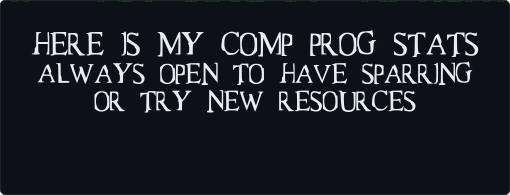</td>
<td>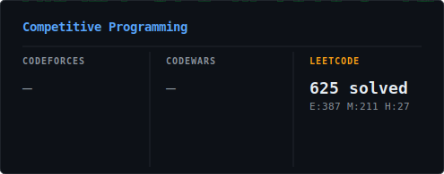</td>
</tr>

<!-- row 3 — codeforces: 495 banner | 165+120 stacked = 285 -->
<tr>
<td>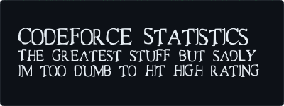</td>
<td>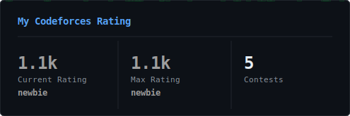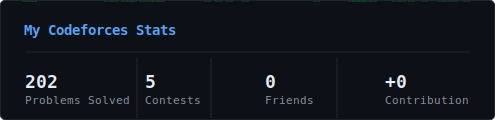</td>
</tr>

<!-- row 4 — codewars: (165+170) | (165+170) = 335 both sides -->
<tr>
<td>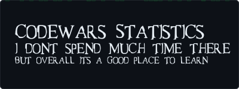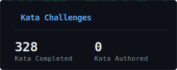</td>
<td>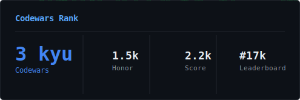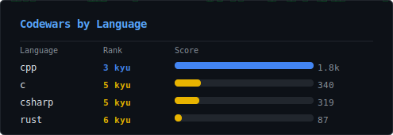</td>
</tr>

<!-- row 5 — leetcode: (181+217+211) | (355+254) = 609 both sides -->
<tr>
<td>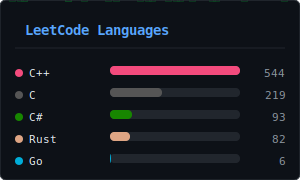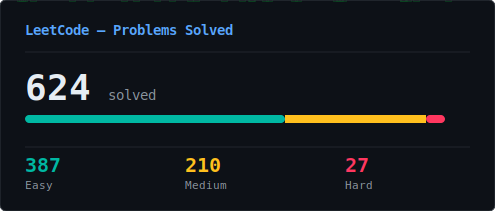</td>
<td>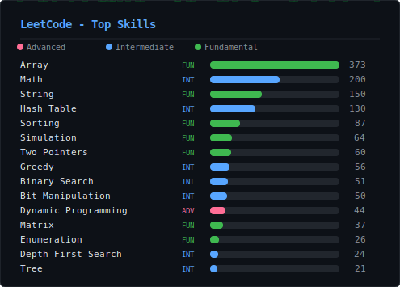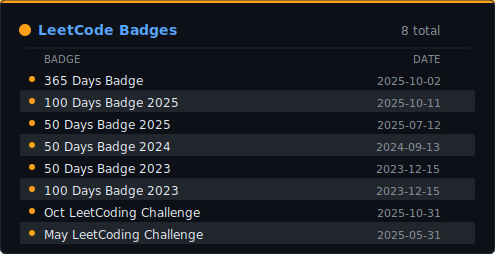</td>
</tr>

<!-- row 6 — commits (year): 325 banner | 150+175 stacked = 325 -->
<tr>
<td></td>
<td>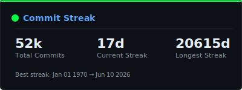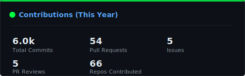</td>
</tr>

<!-- row 7 — commits (detail): 990 banner, then 495 + 495 -->
<tr><td colspan="2"></td></tr>
<tr>
<td>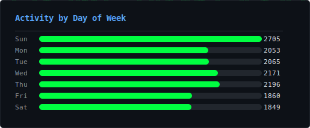</td>
<td>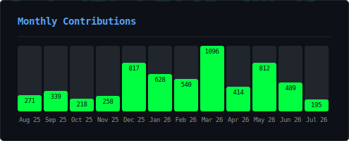</td>
</tr>

<!-- row 8 — full profile: 990 banner, then (120+195) | (120+195) = 315 both sides -->
<tr><td colspan="2">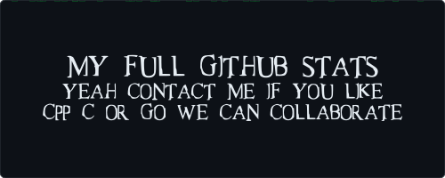</td></tr>
<tr>
<td>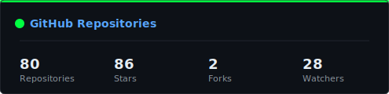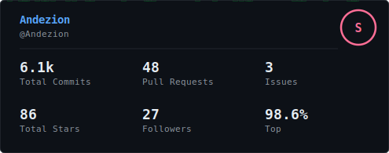</td>
<td>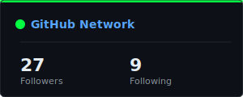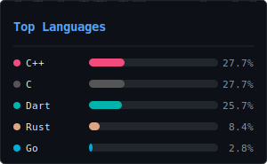</td>
</tr>

<!-- row 9 — visitors + engagement: 676 | 676 -->
<tr>
<td>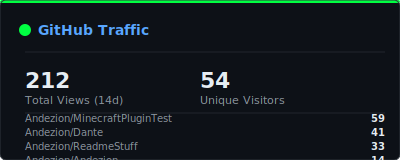</td>
<td>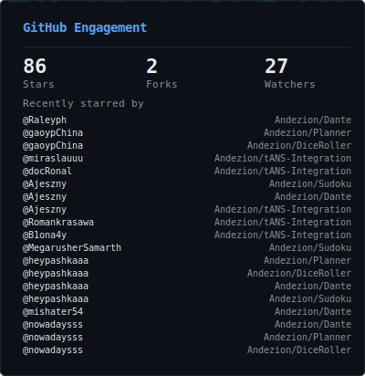</td>
</tr>

</table>
```

### Before this renders correctly

The 19 data-driven widgets (`cf-*`, `cw-*`, `lc-*`, `github-*-dark`,
`competitive-dark`) were resized **in the generator source** (`draw/src/*.rs`),
so the next `cargo run -p readme-stuff-cli` (or the next scheduled CI run)
produces files whose native `viewBox` already matches the sizes used above —
no stretching, no letterboxing.

The 8 banner cards below are plain text cards (`--text-only`), so their size
is just a CLI argument — regenerate each one with its target width/height
before the grid above will look right (until then their `viewBox` won't match
the `` box and they'll render letterboxed):

| file | width | height |
|---|---|---|
| `test1_stuff.svg` | 990 | 120 |
| `test2_stuff.svg` | 495 | 195 |
| `codeforce.svg` | 495 | 285 |
| `codewars.svg` | 495 | 165 |
| `leetcode.svg` | 495 | 181 |
| `commits.svg` | 495 | 325 |
| `commits_details.svg` | 990 | 80 |
| `full.svg` | 990 | 90 |

```
cargo run -p readme-stuff-cli -- --text-only --text-file <your text file> readme_test/test1_stuff.svg 990 120
cargo run -p readme-stuff-cli -- --text-only --text-file <your text file> readme_test/test2_stuff.svg 495 195
cargo run -p readme-stuff-cli -- --text-only --text-file <your text file> readme_test/codeforce.svg 495 285
cargo run -p readme-stuff-cli -- --text-only --text-file <your text file> readme_test/codewars.svg 495 165
cargo run -p readme-stuff-cli -- --text-only --text-file <your text file> readme_test/leetcode.svg 495 181
cargo run -p readme-stuff-cli -- --text-only --text-file <your text file> readme_test/commits.svg 495 325
cargo run -p readme-stuff-cli -- --text-only --text-file <your text file> readme_test/commits_details.svg 990 80
cargo run -p readme-stuff-cli -- --text-only --text-file <your text file> readme_test/full.svg 990 90
```

Swap in whichever `--text-file`/`--text-align`/`-c` you originally used for
each banner — only the width/height/output-name need to change. The height
argument is a *minimum*, so as long as your text is short (it is, these are
one-to-three-line headers) each card pads out to exactly that height.
